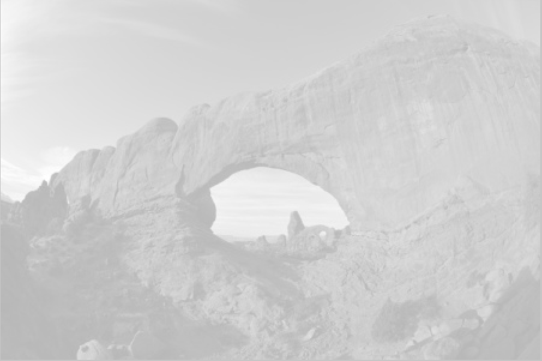
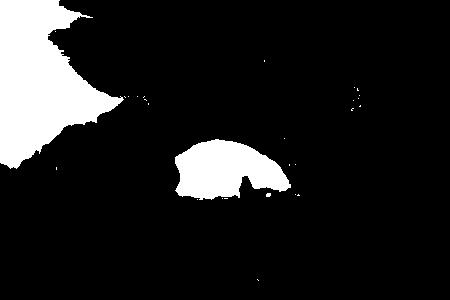
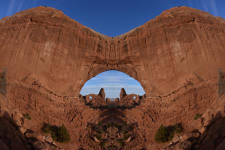
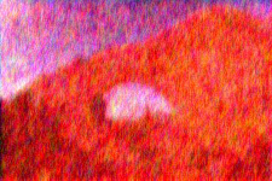
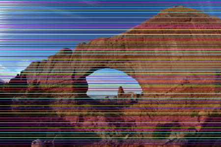

# Student README

This is _your_ README. Use this space to share how you approached the problems of this project. This need not be a diary, but should contain information about decisions you made, challenges you faced, and your understanding of the content of the project. 

- Fully describe the effect of each of your filters and how that effect was achieved by modifying pixel data of the image. Include a written description and example pictures in your readme. 

**The image being manipulated by the filters below is here:**

- _NOTE: This Student README does not contain the original filters created by Austin. Those can be seen in `README.md`._
	1. **Ghost** (`GhostFilter.java`) - The Ghost filter is much like the Grayscale filter; however, it differs in that it adds 25 to the average color value and changes the alpha value to 80, making the image semi-transparent.
	
	2. **Sheer B & W** (`SheerBWFilter.java`) - The Sheer B & W filter is a very harsh black and white filter. Here's how it works: like the Grayscale filter, it averages the RGB values of each color. If that average value is greater than 127, the pixel is replaced with white. Otherwise, the pixel is replaced with black. The image is thereby made up solely of black and white.
	
	3. **Reverse** (`ReverseFilter.java`) - The Reverse filter inverts an image horizontally. It does so by creating a 2D array storing x-values in reverse order and y-values in the original order. It then applies these pixel values to those of the original image, thus reversing the image horizontally.
	
	4. **Mirror** (`MirrorFilter.java`) - I created the Mirror filter by accident, hoping to create an effect like that of the Reverse filter (flip the image along the y-axis [horizontally]). That being said, I still think it's pretty cool; it has the same effect as the mirrored filter in Photo Booth, for example. It sets the value of each pixel to the pixel at the same y-value but at the x-value of the image's width minus the x-value. Thus, the first half of the image looks exactly like the Reverse filter. However, once the filter reaches the halfway mark, it will start to pull colors from pixels that had already been mirrored. Because the second half of the image is copied from the first half, the result appears to be mirrored down the middle of the image.
	
	5. **Spicy** (`SpicyFilter.java`) - The Spicy filter was one of my favorites to create, though it required the most amount of effort and testing to bring it to my desired standards. The filter averages 6-by-6-pixel chunks of the image at a time (overlapping, as it moves pixel by pixel and looks at the next six after in x and y directions). From there, the filter increases the red value of the RGB color and also adds or subtracts (randomly) a random number value from the red, green, and blue values. The filter is somewhat like one known as "deep fried" that is sometimes used in Internet memes.
	
	6. **Barred** (`BarFilter.java`) - This filter replaces each line with a y-value that is divisible by 5 (using `%` operator to determine that) with a bar of a randomly selected solid color. It has the effect of placing several randomly colored horizontal bars along the image.
	
- What challenges did you face while completing the project? How did you address them?  
	- **While completing the project, I faced a few challenges. I had my most significant challenge in the Reverse filter. I was not sure how to reverse the image without mirroring it down the middle (I made that mistake into its own filter, the Mirror filter). I addressed this issue by creating a two-dimensional array to store the color values of each row temporarily (in reverse), and I then replaced the original color values of each pixel with the ones from the array.**
- How did you test your code? Explicitly describe examples of your test cases. 
	- **I tested my code primarily by feeding the program images off of my computer and analyzing the results. If something was not working quite the way I wanted it, I would go back to my code and attempt to make the change I thought was necessary.**
- (Bonus 2 pts.) Provide suggestions of how you would improve the documentation, sample code, testing, or other aspects of the project (up to 2 points extra credit available for noteworthy suggestions here, e.g., actual descriptions of how you would change things, sample code, code for tests, etc.) You will not receive bonus points for simply reporting an issue - you should provide actionable suggestions on how to improve things.
	- **Here are a few ways I would improve my project:**
		- Comment all code thoroughly so that anyone can understand it
		- CONSISTENTLY add Javadoc comments because it's good practice and that way other people will be able to understand your methods
			- _NOTE: I wrote some Javadoc-style comments in my code, but I would like to extend that to all of my helper methods._
		- For both Spicy and Barred filters, make filtering dependent on size. In the Spicy filter, it would be easy to change the size of the averaged chunks. Perhaps it would be better for the images if the chunk sizes depended on the image size. For the bar filter, the bars look very small in a large image. Perhaps I could make the size and frequency of the bars themselves dependent on image size.
